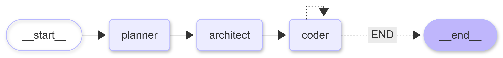

<div align="center">
  <h1>🛠️ Forge</h1>
  <p><strong>An AI-powered coding assistant that acts like your personal multi-agent development team.</strong></p>

  [](https://www.python.org/)
  [](https://github.com/langchain-ai/langgraph)
</div>

---

**Forge** takes your natural language requests and transforms them into complete, working projects. Using real developer workflows, it plans, architects, and writes code file by file, automating the heavy lifting of software engineering.

## ✨ Features

- **End-to-End Generation:** From a single prompt to a fully working project.
- **Multi-Agent Workflow:** Utilizes specialized agents (Planner, Architect, Coder) for high-quality output.
- **Iterative Refinement:** Writes and modifies code with context-awareness.

---

## 🏗️ Architecture

Forge relies on a cooperative multi-agent system powered by **LangGraph**:

1. 🎯 **Planner Agent** – Analyzes your request and generates a detailed, structured project plan.
2. 📐 **Architect Agent** – Breaks down the plan into specific engineering tasks with explicit context and constraints for each file.
3. 💻 **Coder Agent** – Implements each task, writes directly to your local file system, and uses developer tools to ensure correctness.

<br/>

<div align="center">
    
</div>

---

## 🚀 Getting Started

### Prerequisites

- **[uv](https://docs.astral.sh/uv/getting-started/installation/)**: Fast Python package installer and resolver.
- **Groq API Key**: Create a free account and get your API key [here](https://console.groq.com/keys).

### ⚙️ Installation & Setup

1. **Create and activate a virtual environment:**
   ```bash
   uv venv
   # On macOS/Linux:
   source .venv/bin/activate
   # On Windows:
   .venv\Scripts\activate
   ```

2. **Install dependencies:**
   ```bash
   uv pip install -r pyproject.toml
   ```

3. **Configure Environment Variables:**
   Create a `.env` file in the root directory (you can copy `.sample_env`) and add your Groq API key:
   ```env
   GROQ_API_KEY=gsk_your_api_key_here
   ```

---

## 💻 Usage

To start generating a project, run the main script and provide a description of what you want to build. You can provide your prompt via the `--prompt` argument:

```bash
python main.py --prompt "Create a simple calculator web application"
```

If you omit the `--prompt` flag, the application will interactively ask you for your prompt in the terminal.

### 🧪 Example Prompts

Here are a few ideas to get you started:

- > *"Create a to-do list application using HTML, CSS, and vanilla JavaScript."*
- > *"Build a simple blog API in FastAPI with a SQLite database."*
- > *"Create a modern, responsive weather dashboard UI."*

---

<div align="center">
  <i>Built with ❤️ for the open-source community.</i>
</div>
